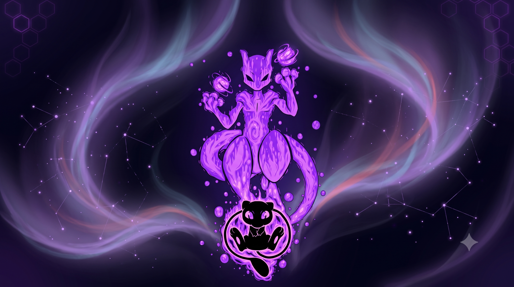

<p align="center">
  
</p>

<h1 align="center">Pokémon TCG AI Battle — Mega Mewtwo X Agent</h1>

<p align="center">
  
  
  
  
  
  
</p>

<p align="center">
  A neuro-symbolic hybrid AI agent engineered for the <strong>Kaggle Pokémon TCG AI Battle Competition</strong>, built around the Mega Mewtwo X win condition. Part heuristic maestro, part entropy detective — and entirely obsessed with KOing your opponent's active Pokémon in exactly the right way.
</p>

---

<p align="center">
  
</p>

---

## What Is This

A purpose-built, single-file Kaggle agent (`main.py`, 703 lines) that plays Pokémon TCG intelligently — not randomly. It understands prize economics, evolves when it should, retreats only when it has to, and never wastes a KO opportunity. The decision engine is deterministic, fast, and ships as a zero-dependency root tarball.

The name says Mega Mewtwo X. The bones are heuristic. The soul is pure competitive pressure.

---

## How It Actually Works

The agent runs a priority-scoring pipeline on every legal action from the engine, picks the highest-ranked one, and logs exactly *why* it made that call.

```
Game Engine
     │  (raw Observation dict)
     ▼
to_observation_class()          ← typed access to board state
     │
     ▼
AttackPlan Evaluator            ← computes damage, weakness, type matchups
     │                            detects Game-Winning KO (score: 50,000)
     ▼
score_option() per action       ← assigns integer priority to each legal move
     │
     ▼
Options Framework               ← maps score → named macro-intent (LETHAL / AGGRO_KO / DEVELOP...)
     │
     ▼
decision_entropy()              ← softmax Shannon entropy across all scores
     │                            tells you how "contested" the turn was
     ▼
top-N indices returned          ← engine executes the move
```

No coin flips. No random tiebreaking. Every decision is traceable.

---

## Scoring Priority Table

| Score Range | Macro-Intent | What's Happening |
|---|---|---|
| 50,000 | **LETHAL** | KO wins the game right now. Do it. |
| 10,000–13,999 | **AGGRO_KO** | KO is live on the active — take the prize. |
| 9,000 | **SETUP** | Riolu to active, strong Pokémon to bench. |
| 7,000–8,499 | **DEVELOP** | Evolve to Mega Mewtwo X, build the bench. |
| 5,500–6,999 | **RESOURCE** | Play a Supporter or Item card. |
| 4,000–5,499 | **POWER_UP** | Attach energy; track the deficit to the closest attack threshold. |
| 4,200 | **STABILIZE** | HP < 40% and a healthy bencher is ready — retreat now. |
| 0–999 | **PASS** | Nothing useful. End the turn. |

Prize-value bonuses stack on top: +3,000 for Mega ex targets, +2,000 for ex, +1,000 for basics.

---

## Decision Entropy

Every turn logs a Shannon entropy score across all candidate action scores:

$$H = -\sum_{i} p_i \log p_i \quad \text{where} \quad p_i = \frac{e^{S_i / T}}{\sum_j e^{S_j / T}}$$

- **Low entropy** → obvious dominant action (easy turn).
- **High entropy** → several equally tempting options (genuinely contested decision).

This goes straight into `game_log.jsonl` alongside the chosen action's macro-intent — feeding future training data without touching the critical path.

---

## Damage Model

Effective damage respects weakness and resistance:

$$D_{\text{eff}} = D_{\text{base}} \times W \;-\; R$$

where $W = 2$ if attacker type matches defender weakness, and $R$ is extracted via regex from the resistance string (handles `-10`, `-20`, `-30`, etc. — not hardcoded).

---

## Repository Structure

```
Pokemon TCG/
├── README.md
├── assets/
│   └── banner.png                          ← this header image
├── ptcg-agent/
│   ├── main.py                             ← production agent (703 lines, one file)
│   ├── cg/                                 ← native cg.api Python bindings
│   ├── PTCG_Baseline_Submission v3.ipynb   ← Kaggle submission notebook (Run All → Submit)
│   ├── tests/                              ← unit tests: parsing, scoring, KO edge cases
│   ├── agent/                              ← modular component library
│   └── legacy_src_variants/               ← earlier iterations (archived)
│
└── resources_and_references/
    ├── memory.md                           ← full session history & derivations
    ├── next_steps.md                       ← roadmap for Phases B & C
    ├── research_done.md                    ← literature review & citations
    ├── tasks.md                            ← checklist: done / in progress / blocked
    ├── changelog.md                        ← semantic version history
    └── implementation_plan.md             ← technical design specs
```

---

## Quickstart

```bash
# Package for Kaggle submission
cd ptcg-agent
tar czf submission.tar.gz main.py deck.csv cg/

# Sanity check locally
python3 -c "import ast; ast.parse(open('main.py').read()); print('Clean.')"
```

The notebook handles everything else. Open `PTCG_Baseline_Submission v3.ipynb` on Kaggle, hit **Run All**, then submit `submission.tar.gz`.

---

## What's Next

- Real observation capture from a live Kaggle match (currently blocked — needs one real run).
- Populate the 84-dimensional state vector with actual board features (currently zeros).
- Train the neural value head (AdamW + bootstrap resampling + ensemble uncertainty gate).
- Phase B: self-play loop + TD(λ) bootstrapping.

See [`resources_and_references/next_steps.md`](resources_and_references/next_steps.md) for the full execution plan.

---

## References

- Sutton, Precup & Singh (1999) — Options Framework, temporal abstraction in RL.
- Schulman et al. (2015) — Generalized Advantage Estimation.
- Loshchilov & Hutter (2019) — AdamW decoupled weight decay.
- Guo et al. (2017) — Temperature scaling for calibration.
- Breiman (1996) — Bagging ensembles.

---

## License

MIT — do what you want, credit if you can.
