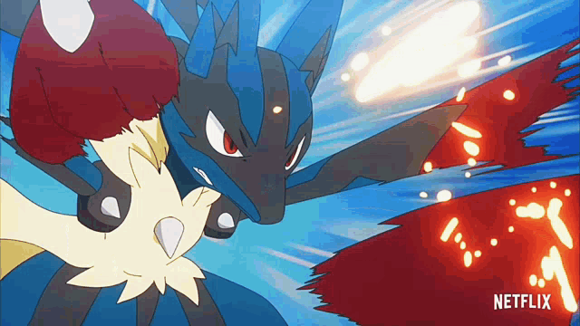

<p align="center">
  
</p>

<h1 align="center">🥋 Pokémon TCG AI Battle — Mega Lucario Z Agent ⚡</h1>

<p align="center">
  <a href="https://github.com/Not-Mally-Raw/Pokemon-TCG-Mega-Lucario-Z"></a>
  
  
  
  
  
  
  
</p>

<p align="center">
  <strong>A tournament-grade autonomous AI agent for the Kaggle Pokémon TCG AI Battle Simulation.</strong><br/>
  Engineered with a high-tempo <strong>Mega Lucario ex / Hariyama / Solrock-Lunatone Fighting shell</strong>, combining deterministic heuristic option scoring, bounded C++ SDK rollout search, empirical-Bayes determinization, and dynamic meta-counter adaptation.
</p>

---

<p align="center">
  
  <br/>
  <sub><em>Animation artwork: <a href="https://www.deviantart.com/roviorapacman2001/art/Lucario-mega-987808064">Lucario-mega by Roviorapacman2001 on DeviantArt</a></em></sub>
</p>

---

## ⚔️ Overview & Competitive Edge

In the **Pokémon TCG AI Battle**, agents face a stochastic, imperfect-information environment constrained by a strict **1.5-second wall-clock per-move budget**. Purely synthetic or unconstrained reinforcement learning frameworks suffer from severe state-space explosion, brittle legality violations, and rollout timeouts.

**Mega Lucario Z** addresses this by deploying a battle-hardened hybrid architecture:

1. **Deterministic Heuristic Spine (`AdvancedPolicy`)**: An exhaustive, prize-aware rule engine scoring all legal options across 9 macro-intents with zero inference latency.
2. **Empirical-Bayes Shared Worlds (`_generate_world_pool`)**: Reconstructs legal 60-card hidden opponent states (deck, prize, hand) dynamically weighted by observed energy attachments and discard piles.
3. **Bounded C++ Engine Search (`SEARCH_ALGO`)**: Directly interfaces with Kaggle's native `libcg.so` via `search_begin()` and `search_step()`, executing real forward game rollouts.
4. **Pessimistic Evidence Gating (`_lcb_score`)**: Lower Confidence Bound selection and a catastrophic loss veto ensure speculative rollouts never override a solid heuristic move without decisive statistical evidence.
5. **Dynamic Runtime Matchup Tech**: Dynamic name-based card ID resolution actively identifies and counters dominant ladder archetypes (*Dragapult ex, Alakazam bench-spread, Crustle stall, and Water cores*).

---

## 🧠 Decision Pipeline & Execution Flow

```
                      Raw Kaggle Observation Dict
                                  │
                                  ▼
                   to_observation_class() [cg.api]
                                  │
                                  ▼
                    AdvancedPolicy Heuristic Engine
          ┌───────────────────────┴───────────────────────┐
          │                                               │
  Macro-Intent Scoring                            Dynamic Matchup Tech
  (Attacks, Evolutions, Gusts,                    (Dragapult / Alakazam /
   Energy, Draw, Retreats)                         Crustle Wall Detectors)
          │                                               │
          └───────────────────────┬───────────────────────┘
                                  │
                        Sorted Candidate Actions
                                  │
                        Is Decision Volatile?
                       (_is_critical_turn check)
                         ┌────────┴────────┐
                        NO                YES
                         │                 │
                         │        Generate Shared Worlds
                         │      (Empirical-Bayes Determinization)
                         │                 │
                         │        Real C++ Rollout Search
                         │      (search_begin / search_step)
                         │                 │
                         │     Conservative Evidence Gate
                         │      (LCB Score > Baseline + Margin)
                         │         ┌───────┴───────┐
                         │      PASSED           FAILED
                         │         │               │
                         │   Finalist Action  V16 Baseline
                         │         │               │
                         └─────────┼───────────────┘
                                   │
                                   ▼
                         battle_select(action)
```

---

## 📊 Priority Scoring Architecture

Options are assigned high-precision integer scores to establish strict, deterministic behavioral hierarchies:

| Priority Band | Macro-Intent | Tactical Context & Execution Criteria |
|:---|:---|:---|
| **500,000 / 50,000** | **GAME-WINNING KO** | Lethal strike available on active or benched Pokémon that wins the match immediately. |
| **10,000–13,999** | **PRIZE-TAKING KO** | Attack deals lethal damage to the target. Stacked with target prize value (+3,000 Mega ex, +2,000 ex, +1,000 Basic). |
| **11,000+** | **EVOLVE-TO-KO** | Immediate evolution enabling an attack that claims an instant Knockout this turn. |
| **9,000+** | **EVOLVE & SETUP** | Staging primary evolution lines (Makuhita $\rightarrow$ Hariyama, Riolu $\rightarrow$ Mega Lucario ex). |
| **8,500–8,800** | **TACTICAL RETREAT** | Preserving heavily damaged attackers ($HP < 25\%$) when a primed benched attacker is ready. Kept below evolution to prevent suicide retreat. |
| **7,000–12,800** | **HERO'S CAPE & TOOLS** | Equipping crucial HP tools (+100 HP). Boosted to 12,800 against Water/Weakness matchups to avoid one-shots. |
| **5,500–6,000** | **GUST & DISRUPT** | Boss's Orders to pull low-HP or high-threat targets into the active spot, enabling immediate KOs. |
| **5,000** | **RESOURCE ACCELERATION** | Playing draw Supporters (Carmine, Lillie's Determination, Premium Power Pro) when hand size or tempo requires card flow. |
| **4,000–5,499** | **ENERGY ATTACHMENT** | Prioritizing energy placement onto attackers nearest their lethal damage thresholds (Mega Brave: 2, Wild Press: 3). |
| **0–999** | **PASS / END TURN** | Clean, safe turn closure when no further productive actions exist. |

---

## 🎯 Dynamic Matchup Detection & Counters

Rather than relying on brittle, hardcoded card IDs that break across game versions or locales, the agent uses **`_resolve_ids_by_name()`** to dynamically inspect the active environment's `card_table` at runtime:

```python
ALAKAZAM_IDS  = _resolve_ids_by_name("alakazam", "kadabra", "abra")
GARDEVOIR_IDS = _resolve_ids_by_name("gardevoir", "gallade")
DRAGAPULT_IDS = _resolve_ids_by_name("dragapult", "drakloak", "dreepy")
CRUSTLE_IDS   = _resolve_ids_by_name("crustle", "dwebble")
WATER_IDS     = _resolve_ids_by_name("kyogre", "snover", "abomasnow")
```

### Counter-Strategies Implemented:
* **🐉 Dragapult ex Defense**: Detects *Phantom Dive* threat (200 active damage + 60 bench snipe). Proactively suppresses benching any Pokémon with $\le 60\text{ HP}$ to prevent free multi-prize turns.
* **🔮 Alakazam Bench Constriction**: Recognizes bench-scaling psychic damage and restricts own bench expansion to $\le 2$ Pokémon, denying the opponent damage multipliers.
* **🦀 Crustle Stall Neutralization**: Detects damage-negation abilities against ex attackers. Deprioritizes Mega Lucario ex attacks into Crustle and transitions all energy to **Hariyama (Wild Press, 210 dmg)** to break through stall walls.
* **🌊 Water Weakness Mitigation**: Senses Kyogre / Abomasnow cores and immediately routes Hero's Cape (+100 HP) to active Fighting Pokémon to survive weakness-boosted attacks.

---

## 🎲 Determinized Search Engine

When a turn is flagged as volatile (`_is_critical_turn` detects an imminent KO or lethal counter-threat), the agent activates the bounded **Sequential Halving & LCB search**:

### 1. Empirical-Bayes World Sampling
Hidden information (opponent deck, prize cards, and hand) is determinized into frozen, immutable `SimulationWorld` instances. Card frequencies are sampled using a **Laplace-smoothed Dirichlet posterior** derived from the opponent's visible energy attachments and discard pile, ensuring realistic opponent hands rather than naive uniform guesses.

### 2. Pessimistic LCB Scoring
To eliminate small-sample noise where an inferior move appears temporarily favorable after 1–2 lucky rollouts, candidates are ranked using Lower Confidence Bound scoring:

$$\text{LCB}(a) = \bar{X}_a - z \cdot \sqrt{\frac{\sigma^2_a}{N_a}} \quad (z = 0.6)$$

### 3. Anti-Regression Evidence Gate
A finalist candidate overrides the heuristic top pick if and only if:
1. `finalist_LCB > baseline_LCB + margin`
2. **Catastrophic Loss Veto**: The finalist experiences no terminal defeats in any simulated world where the baseline survives.
3. Total search time remains strictly within `SEARCH_TIME_BUDGET` (1.5s).

---

## 🛡️ Deck List (60-Card Fighting Core)

The agent operates a tuned 60-card Mega Lucario ex & Hariyama archetype built for aggression and consistent energy attachment:

| Category | Card ID(s) | Name & Breakdown | Count | Strategic Function |
|:---|:---|:---|:---:|:---|
| **Primary Attacker** | `677`, `678` | Riolu (4) / Mega Lucario ex (4) | 8 | Main sweeper (270 dmg Mega Brave, 130 dmg Aura Strike) |
| **Secondary Attacker** | `673`, `674` | Makuhita (2) / Hariyama (2) | 4 | Heavy one-prize wall & anti-stall breaker (210 dmg Wild Press) |
| **Energy Support** | `675`, `676` | Lunatone (2) / Solrock (3) | 5 | Free retreat pivot & early fighting energy acceleration |
| **Search Items** | `1102`, `1142` | Dusk Ball (4) / Fighting Gong (4) | 8 | High-velocity Pokémon and basic fighting search |
| **Mobility & Recovery** | `1123`, `1152` | Switch (2) / Poké Pad (2) | 4 | Tactical active-bench swapping & item recursion |
| **Defensive Tool** | `1159` | Hero's Cape | 1 | +100 HP game-swinging defensive asset |
| **Tactical Supporter** | `1182` | Boss's Orders | 4 | Bench gusting for decisive multi-prize knockouts |
| **Draw Supporters** | `1141`, `1192`, `1227` | Premium Power Pro (4) / Carmine (4) / Lillie (4) | 12 | Maximum velocity hand refilling & draw power |
| **Stadium** | `1252` | Gravity Mountain | 1 | Stage 2 HP suppression stadium |
| **Energy Cards** | `6` | Basic Fighting Energy | 13 | Primary elemental fuel |

---

## 📁 Repository Structure

```
Pokemon-TCG-Mega-Lucario-Z/
├── README.md                                 ← Project overview & architectural documentation
├── assets/
│   ├── banner.png                            ← High-resolution Mega Lucario header artwork
│   └── mega_lucario.gif                      ← Battle action animation (Roviorapacman2001)
│
├── ptcg-agent/
│   ├── main.py                               ← Unified standalone agent (AdvancedPolicy + Search)
│   ├── deck.csv                              ← Formatted 60-card tournament decklist
│   ├── cg/                                   ← Official Kaggle C++ simulation SDK & Python bindings
│   │   ├── api.py                            ← Observation dataclasses & search wrappers
│   │   ├── game.py                           ← Battle loop control (battle_start, battle_select)
│   │   ├── sim.py                            ← Forward simulation interfaces
│   │   └── libcg.so                          ← Native Linux x86_64 simulation engine
│   ├── scripts/
│   │   └── build_submission.sh               ← Standard Kaggle packaging script (<197.7 MiB check)
│   └── tests/                                ← Offline test harness & mock simulation tests
│
└── notebooks/
    ├── pokemon-tcg-ai-hackathon-19.ipynb     ← Production-ready Kaggle submission notebook
    └── observation_parser.ipynb              ← Diagnostic observation decoder
```

---

## 🚀 Packaging & Verification

To compile the standalone competition archive:

```bash
cd ptcg-agent

# 1. Package root main.py, deck.csv, and cg/ SDK (<197.7 MB)
./scripts/build_submission.sh

# 2. Syntax & static validation
python3 -m py_compile main.py cg/api.py cg/game.py cg/sim.py
```

### Kaggle Verification Contract
When executed on the Kaggle runtime, the notebook performs a full self-game smoke test, producing the verified four-line confirmation:

```text
main module file: /kaggle/working/main.py
agent() line 0: def agent(obs_dict: dict) -> list[int]:
startup deck return: OK
official engine self-game selections: 113
Package assert: OK
```

---

## 📜 Version History & Milestones

* **v19.0 (Current)** — *Full Kaggle-Ready Real-Engine Release*: Purged mock evaluators; dynamic card ID resolution for all 5 meta archetypes; board-aware opponent modeling; verified self-game under official `libcg.so`.
* **v18.0** — Replaced raw-mean UCB with pessimistic Lower Confidence Bound (LCB) scoring; integrated empirical-Bayes opponent energy determinization; added Dragapult ex bench-snipe defense.
* **v16.0** — Restored non-KO attack damage scaling (`8500 + 3000 * frac`); graduated retreat urgency; integrated attack table damage lookups.
* **v10.0** — Migrated to 7-parameter `search_begin` C++ SDK interface with universal attack preload.

---

## 📄 License

This project is licensed under the **MIT License** — free to use, modify, and build upon. Community contributions and discussions are welcome!

<p align="center">
  <sub>Built for the Kaggle Pokémon TCG AI Battle Competition • Maintained by <a href="https://github.com/Not-Mally-Raw">Not-Mally-Raw</a></sub>
</p>
